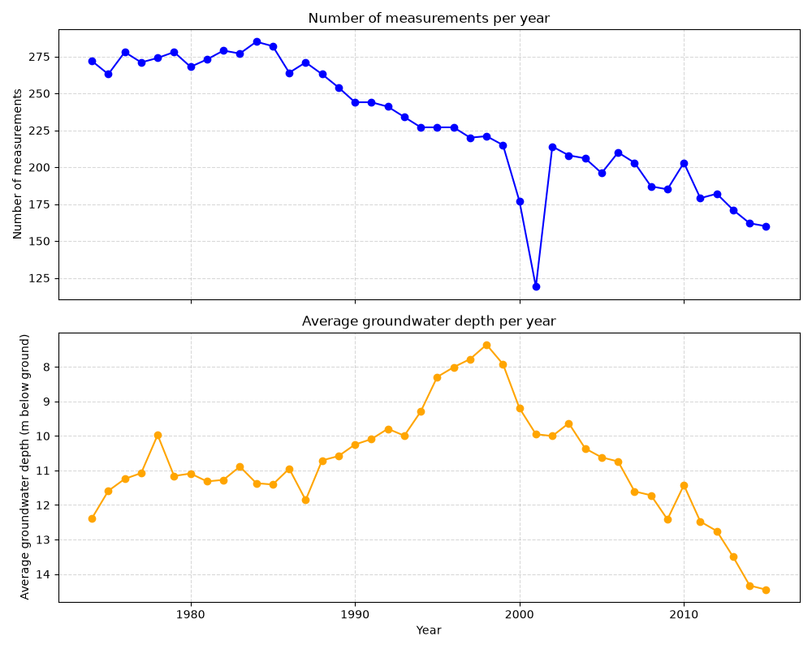

# Groundwater levels in Punjab and Haryana, 1974-2015

A small data pipeline I built to practise the whole path of a data project: get public data, clean it, store it in a database and look at what it says.

The data are groundwater measurements from wells in northwest India. The water table in this area is a topic I care about, so I wanted my first project to be about it.

## What it does

1. Downloads the dataset and keeps the wells in India.
2. Cleans it (more on this below).
3. Saves it in MySQL, in two tables: one for the wells and one for the measurements.
4. Runs a SQL query for the average depth and the number of measurements per year, and plots the result.

Tools: Python, Pandas, SQLAlchemy, MySQL, Matplotlib, Git.

## The data

The dataset is public (MacAllister et al., 2022) and I load it with the *aqua_fetch* library. It has 717 wells in India and 20,249 measurements, one per well per year, taken in October. The value I use is the depth of the water in metres below the ground: the bigger the number, the deeper the water.

## What I changed in the data, and why

- Many rows had no measurement, so I dropped them.
- Before 1900 there are only a few measurements per year, so I left those years out.
- Around 1973 the number of wells measured each year jumps from about 150 to about 370. To avoid comparing two different networks, I start in 1974.
- I kept only the wells with at least 30 measurements, so the trend is based mostly on the same wells over time.
- 2016 and 2017 have very few measurements (70 and 62), so I stopped at 2015.

What is left: 322 wells and 9,614 measurements.

## What I found

From 1974 to 1998 the average depth went from 12.4 m to 7.4 m, so the water table got closer to the surface. After that it dropped: by 2015 the average depth was 14.5 m, about 7 m deeper than in 1998.

## What this does not tell you

- The data stop in 2017.
- The dataset covers the wider Punjab region, so some of the wells are in Haryana.
- The number of measurements falls from 272 in 1974 to 160 in 2015, so the wells are not exactly the same every year.
- In 2000 and 2001 there are only 177 and 119 measurements, so those two years are less reliable.
- I only describe the trend. I do not explain why it happens.

## Run it yourself

1. Install the libraries: *pip install -r requirements.txt*
2. In MySQL, run *schema.sql* and create a user for the database.
3. Copy *.env.example* to *.env* and write your own database details.
4. Run *pipeline.py*, then *grafici.py*.

## Next

I want to schedule the pipeline with Airflow and build a Power BI dashboard on the database. I also need to make the loading step safe to run twice, because right now running it again duplicates the rows.
